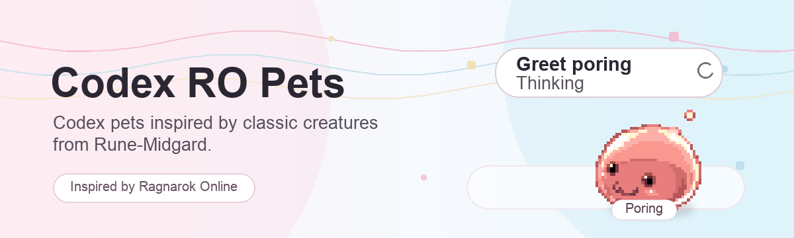

# Codex RO Pets

A collection of custom Codex pets inspired by classic creatures and characters from the Ragnarok Online universe.

Each pet preserves the original pixel-art look in an atlas compatible with the Codex pet format: `pet.json` + `spritesheet.webp`.

## Included Pets

| Pet        | Folder            |
| ---------- | ----------------- |
| Alice      | `pets/alice`      |
| Atroce     | `pets/atroce`     |
| Baphomet   | `pets/baphomet`   |
| Bongun     | `pets/bongun`     |
| Eddga      | `pets/eddga`      |
| Hatii Baby | `pets/hatii-baby` |
| High Orc   | `pets/high-orc`   |
| Kafra 1    | `pets/kafra-1`    |
| Kafra 2    | `pets/kafra-2`    |
| Kafra 3    | `pets/kafra-3`    |
| Kafra 4    | `pets/kafra-4`    |
| Kafra 5    | `pets/kafra-5`    |
| Kafra 6    | `pets/kafra-6`    |
| Myst Case  | `pets/myst-case`  |
| Munak      | `pets/munak`      |
| Orc Lord   | `pets/orc-lord`   |
| Peco Peco  | `pets/peco-peco`  |
| Poring     | `pets/poring`     |
| Rocker     | `pets/rocker`     |
| Sohee      | `pets/sohee`      |
| Spore      | `pets/spore`      |
| Valkyrie   | `pets/valkyrie`   |

## Installation

Copy a specific pet into your Codex pets folder:

```sh
mkdir -p "$HOME/.codex/pets"
cp -R pets/poring "$HOME/.codex/pets/"
```

Or install all pets:

```sh
mkdir -p "$HOME/.codex/pets"
cp -R pets/* "$HOME/.codex/pets/"
```

Then restart or reload Codex so the pets appear in the selector.

## Structure

Each directory in `pets/` follows this format:

```text
pets/<pet>/
├── pet.json
└── spritesheet.webp
```

The `spritesheet.webp` file uses the standard Codex pet atlas:

| Property      | Value                    |
| ------------- | ------------------------ |
| Total size    | `1536x1872`              |
| Grid          | `8` columns x `9` rows   |
| Cell          | `192x208`                |
| Background    | Transparent              |

## Notes

This is an unofficial fan-made project. Ragnarok Online and related trademarks belong to their respective owners.
